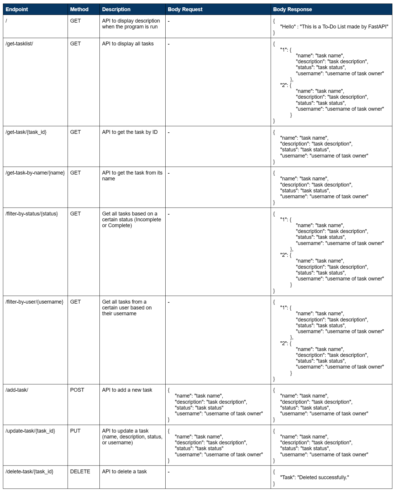
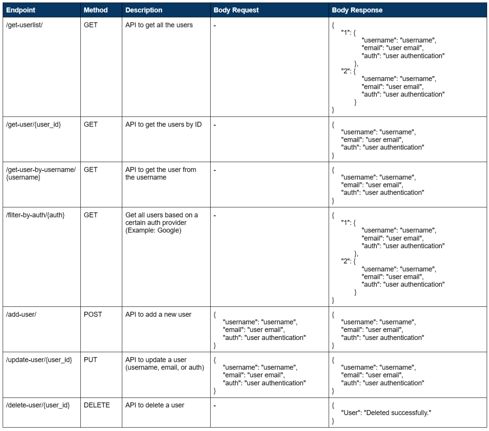
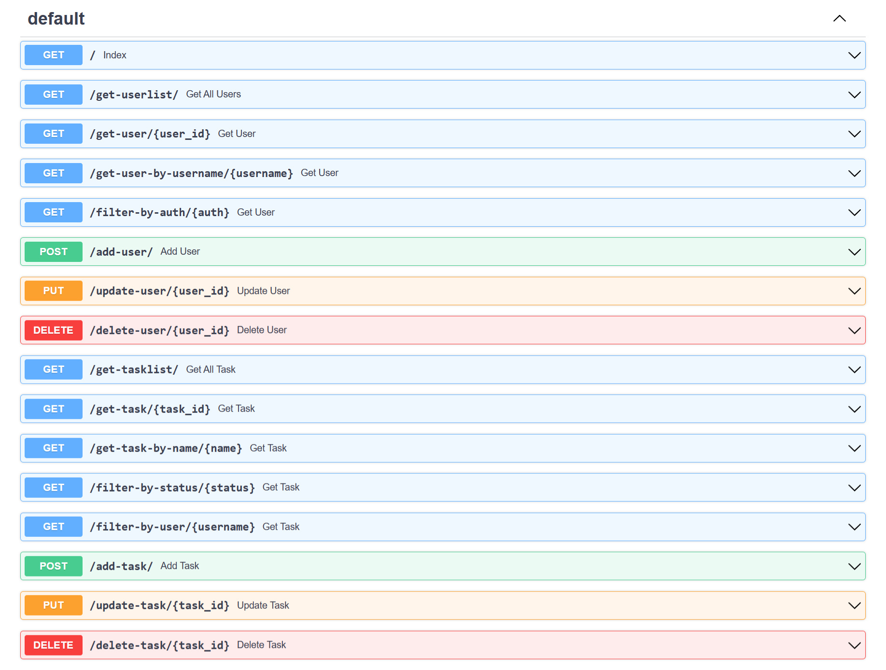

<h1 align="center">RESTful To-Do List using Fast API</h1>
This is a REST API created using Fast API for a To-Do List with multi-user support.

The design of the API is seen as followed.

## Task Endpoint Design

## User Endpoint Design

## File Directory
The .py file containing the codes can be found in the [virtual environment](venv) folder named as [main.py](venv/main.py).

The requirements needed to run the program can be found in the [requirements](requirements.txt) file.

## SwaggerUI Documentation

The API endpoints provided by the code is summarized through the Swagger UI documentation below.

